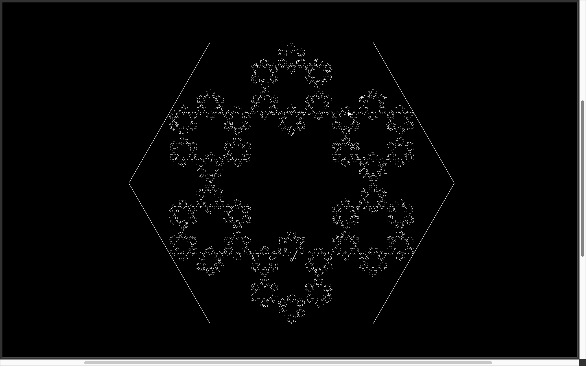

# Hexagon Fractals!

## This program starts with a random point within an equalateral hexagon. It then uses this point, and one of the 6 hexagon sides to create a triangle. After this, it finds the centroid of the triangle and continues making another triangle, using this new centroid point as the 'random point'. It then continues this process to create 100,000 points.

## Below is an example of what the program looks like - this image is not the final, but rather a SS taken in the middle of the program running

### Hope you enjoy! If you want to view my main GitHub page, you can click - [here](https://www.github.com/fiji05)